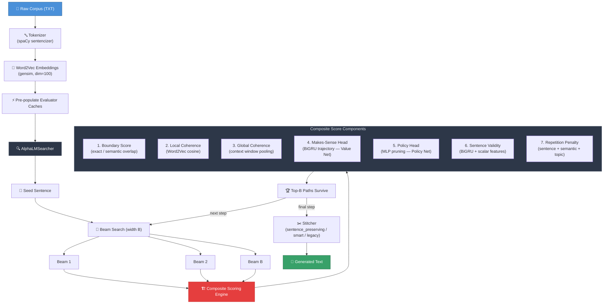

# AlphaLM — Neural Language Trajectory Search

> *An AlphaZero-inspired beam search system for coherent text generation from a raw corpus.*

---

## Overview

**AlphaLM** is a research-grade text generation system that treats language generation as a **combinatorial search problem** rather than a prediction problem. Instead of training a language model to predict the next token, AlphaLM searches a corpus of real sentences to find the sequence that forms the most coherent, diverse, and valid text trajectory.

The system is built around a composite scoring engine, an ensemble of small neural evaluators, and a multi-level repetition control system — all orchestrated by a Beam Search algorithm that looks ahead before committing to each sentence.

AlphaLM was developed and iterated through versions **v3 → v5.5.4**, with each version introducing architectural improvements benchmarked through rigorous ablation studies.

---

## AlphaZero Analogy

AlphaLM is directly inspired by DeepMind's **AlphaZero** architecture for game-playing AI. The conceptual mapping is as follows:

| AlphaZero Component | AlphaLM Equivalent |
|:----|:----|
| **Game Board State** | Current trajectory of selected sentences |
| **Legal Moves** | All candidate sentences in the corpus |
| **Monte Carlo Tree Search (MCTS)** | Beam Search over sentence trajectories |
| **Policy Network** | `AlphaLMPolicyHead` — a learned MLP that prunes the candidate space |
| **Value Network** | `DeepMakesSenseEvaluatorTransformer` (v6) / `DeepMakesSenseEvaluatorV2_1` (v5.5) — scores trajectory coherence |
| **Move Quality Heuristics** | Boundary matching, local/global coherence, sentence validity |
| **Exploration vs. Exploitation** | Repetition Penalty System — penalises revisiting explored semantic territory |
| **Rollout / Lookahead** | Beam width B — evaluates B parallel futures before committing |

In AlphaZero, the **Policy Network** tells the MCTS which moves are *worth exploring*, while the **Value Network** evaluates whether the resulting board position is *good*. AlphaLM follows the same separation:

- The **Policy Head** prunes the ~20,000 candidate sentences down to the top 100 at each step — fast filtering, analogous to move pruning.
- The **Makes-Sense Head** scores the full trajectory sequence, analogous to position value estimation.
- The **Beam Search** is the MCTS: it keeps B candidate futures alive in parallel, committing only to the best after full evaluation.

The core insight shared with AlphaZero: **search, guided by learned evaluators, outperforms pure heuristics or greedy decisions.**

---

## Architecture



---

## Scoring System

### Composite Score Formula (v5.5.3)

$$
S_{\text{total}} = \underbrace{w_b \cdot S_{\text{boundary}} + w_l \cdot S_{\text{local}} + w_g \cdot S_{\text{global}} + w_m \cdot S_{\text{makes\_sense}} + w_p \cdot S_{\text{policy}} + w_v \cdot S_{\text{validity}}}_{\text{Positive Signal (Quality)}} \;-\; \underbrace{\Big( w_{sr} \cdot R_{\text{sent}} + w_{se} \cdot R_{\text{sem}} + w_{tr} \cdot R_{\text{topic}} - w_{tp} \cdot P_{\text{progress}} \Big)}_{\text{Repetition Penalty}}
$$

Where:

$$
S_{\text{boundary}} = \begin{cases} 10 + m & \text{if exact match } m > 0 \\ \cos(\mathbf{e}_{\text{suffix}},\; \mathbf{e}_{\text{prefix}}) & \text{otherwise} \end{cases}
$$

$$
S_{\text{local}} = \cos\big(\bar{\mathbf{v}}_{t-1},\; \bar{\mathbf{v}}_{\text{cand}}\big) \qquad\qquad S_{\text{global}} = \cos\left(\frac{1}{W}\sum_{i=t-W}^{t-1} \bar{\mathbf{v}}_i,\;\; \bar{\mathbf{v}}_{\text{cand}}\right)
$$

$$
R_{\text{topic}} = \max\!\Big(0,\;\; \cos\big(\bar{\mathbf{v}}_{\text{cand}},\; \boldsymbol{\mu}_{\text{topic}}\big) - \tau\Big) \qquad \text{where} \quad \boldsymbol{\mu}_{\text{topic}} = \frac{1}{t}\sum_{i=1}^{t} \bar{\mathbf{v}}_i
$$

### Default Weights (Tuned)

> *Tuned on the sales+newton dataset via hyperparameter sweep (+10.7 overall score improvement over initial defaults).*

| Component | Weight |
|:---|:---:|
| Boundary Matching | 1.0 |
| Local Coherence | 3.0 |
| Global Coherence | 3.0 |
| Deep Makes-Sense | 3.0 |
| Policy Head | 1.0 |
| Sentence Validity | 1.5 |
| Sentence Rep Penalty | 1.0 |
| Semantic Rep Penalty | 0.25 |
| Topic Rep Penalty | 2.25 |
| Topic Progress Bonus | 0.5 |

---

## Neural Evaluators

### 1. Makes-Sense Trajectory Evaluator
**Role (AlphaZero analogy: Value Network)**

Scores whether a trajectory of sentences flows naturally and follows a coherent path.

*   **v6 Transformer (`DeepMakesSenseEvaluatorTransformer` - Default)**:
    *   *Architecture*: Projector $\rightarrow$ Positional Embeddings $\rightarrow$ 2-layer Transformer Encoder (hidden=128, heads=4, d_ff=256) $\rightarrow$ Mean + Max Pooling Concatenation $\rightarrow$ MLP Classifier (128 $\rightarrow$ 32 $\rightarrow$ 1).
    *   *Advantages*: Directly compares all trajectory positions via attention, allowing much stronger global coherence and topic flow reasoning.
*   **v5.5 BiGRU (`DeepMakesSenseEvaluatorV2_1`)**:
    *   *Architecture*: Bidirectional GRU (hidden=128) $\rightarrow$ LayerNorm $\rightarrow$ MLP.
    *   *Input*: Sequence of sentence embeddings (padded to length 6).

### 2. Policy Head — `AlphaLMPolicyHead`
**Role (AlphaZero analogy: Policy Network)**

A **feedforward MLP** that takes the last 4 sentence embeddings (concatenated as a context window) and predicts whether a candidate sentence is a good continuation. Used for **early pruning**: reduces 20,000+ candidates to the top 100 before expensive evaluation.

- Architecture: MLP with layers `[256, 64, 1]`, ReLU activations
- Input: `window_size × embedding_dim` concatenated vector
- Output: Continuation probability → used to rank and prune candidates

### 3. Sentence Validity Evaluator
**Role: Grammatical/syntactic quality gate**

Scores whether a single sentence is well-formed, readable, and structurally valid.

*   **v6 Transformer (`SentenceValidityEvaluatorTransformer` - Default)**:
    *   *Architecture*: Trainable Token Embeddings $\rightarrow$ Positional Embeddings $\rightarrow$ 2-layer Transformer Encoder (hidden=128, heads=4, d_ff=256) $\rightarrow$ Global Max Pooling $\rightarrow$ Transformer MLP (32) $\rightarrow$ Late concatenation of 7 scalar features $\rightarrow$ Classification MLP $\rightarrow$ Sigmoid validity probability.
    *   *Advantages*: Attention-based syntax checking prevents boundary splices, hybrid fragments, and structural corruptions.
*   **v5.5 BiGRU (`SentenceValidityEvaluatorV2`)**:
    *   *Architecture*: Word Embeddings $\rightarrow$ Bidirectional GRU $\rightarrow$ Max Pooling $\rightarrow$ Late concat of 7 scalar features $\rightarrow$ Classification MLP.
- Handcrafted scalar features: character length, token count, punctuation density, unique token ratio, repeat bigrams, seen corpus bigram ratio, and boundary fusion markers.
- Evaluator dynamically applies low-validity penalties and token-length normalization filters.

---

## Repetition Control System (v5.5.3)

AlphaLM v5.5.3 introduced a **three-level repetition penalty** that discourages the search from revisiting semantic territory it has already explored — analogous to AlphaZero's exploration bonus in MCTS.

| Level | Mechanism | Effect |
|:---|:---|:---|
| **Sentence Repetition** | Exact-string match gate | Prevents verbatim duplicates |
| **Semantic Repetition** | Cosine distance ≥ 0.85 threshold | Prevents near-paraphrase repetition |
| **Topic Repetition** | Cosine distance to running topic centroid | Prevents orbiting the same concept cluster |
| **Topic Progress Bonus** | Reward for semantic novelty vs. history | Encourages forward exploration |

The **topic memory** is a running mean of all selected sentence embeddings — it represents "where the trajectory has been so far." Sentences that are too close to this centroid are penalised, nudging the beam search toward new semantic ground.

---

## Boundary Stitching (v5.5.2)

When beam search selects a sequence of corpus sentences, their boundaries may overlap (e.g., sentence A ends with "building rapport" and sentence B begins with "building rapport and trust"). The **stitcher** handles how these sentences are joined.

Three modes are available:

| Mode | Behaviour |
|:---|:---|
| `sentence_preserving` | Keeps each sentence intact, joined with punctuation. Most readable. |
| `smart` | Merges sentence boundaries only when the resulting sentence passes validity scoring. |
| `legacy` | Aggressive word-level overlap collapsing (original v3 behavior). |

The `smart` mode uses the **Sentence Validity Head** as an oracle: it only merges two sentences if the merged result scores higher validity than they do separately.

---

## Project Structure

```
AlphaLM/
│
├── search.py                    # AlphaLMSearcher — beam search orchestrator
├── tokenizer.py                 # spaCy sentence splitting + word tokenization
├── embeddings.py                # Word2Vec training & mean vector helpers
├── path_scorer.py               # Local + Global coherence (Word2Vec cosine)
├── scorer.py                    # Exact boundary match scoring
├── similarity.py                # Cosine similarity utilities
├── config.py                    # Global weights, paths, hyperparameters
│
├── models/
│   ├── makes_sense_v2_1.py      # DeepMakesSenseEvaluatorV2_1 (BiGRU, legacy value net)
│   ├── sentence_validity_v2.py  # SentenceValidityEvaluatorV2 (BiGRU + scalar)
│   ├── makes_sense_transformer.py # DeepMakesSenseEvaluatorTransformer (Transformer, default)
│   ├── sentence_validity_transformer.py # SentenceValidityEvaluatorTransformer (Transformer + features, default)
│   ├── makes_sense_tinystories_transformer.pt # TinyStories Makes-Sense Transformer checkpoint
│   ├── validity_tinystories_transformer.pt # TinyStories Validity Transformer checkpoint
│   ├── makes_sense_tinystories.pt  # TinyStories Makes-Sense BiGRU checkpoint
│   ├── validity_tinystories.pt  # TinyStories Validity BiGRU checkpoint
│   └── tinystories_word2vec.model  # TinyStories Word2Vec model
│
├── policy/
│   ├── infer.py                 # AlphaLMPolicyHead (MLP, policy net)
│   ├── model.py                 # MLP architecture
│   └── policy_config.py        # Policy hyperparameters
│
├── scoring/
│   ├── repetition_sentence.py  # Exact-match repetition gate
│   ├── repetition_semantic.py  # High-cosine semantic repetition penalty
│   ├── repetition_topic.py     # Topic centroid penalty
│   ├── topic_progress.py       # Exploration novelty bonus
│   ├── validity_features.py    # Handcrafted scalar features for validity
│   └── length_penalty.py       # Token-length penalty for validity head
│
├── rendering/
│   ├── stitcher.py             # Text stitcher (sentence_preserving / smart / legacy)
│   └── boundary_validator.py   # Validity-based merge safety check
│
├── training/                   # Training scripts for all evaluators
├── streamlit_app.py            # Interactive dashboard (Beam vs. Greedy comparison)
│
├── sales_dataset.txt           # Primary training corpus
├── newton_dataset.txt          # Secondary training corpus
└── tinystories_1m.txt          # TinyStories narrative corpus (v5.5.4)
```

---

## Supported Corpora

| Corpus | Sentences | Domain | Models Trained |
|:---|:---:|:---|:---|
| `sales_dataset.txt` | ~4,000 | Sales & persuasion | Makes-Sense v2.1, Policy, Validity v2, Word2Vec |
| `newton_dataset.txt` | ~3,000 | Philosophy & science | Combined with sales above |
| `tinystories_1m.txt` | ~21,882 | Children's narratives | Dedicated Makes-Sense, Policy, Validity, Word2Vec |

---

## Version History

| Version | Key Contribution |
|:---|:---|
| **v3** | Core beam search + boundary matching + Word2Vec heuristics |
| **v5.5** | Deep Makes-Sense Head (BiGRU trajectory evaluator) |
| **v5.5.1** | Sentence Validity Head v2 (BiGRU + scalar features) |
| **v5.5.2** | Boundary Stitching refactor — `sentence_preserving` and `smart` modes; validity-gated merging |
| **v5.5.3** | Multi-Level Repetition Control System (sentence, semantic, topic penalty + progress bonus) |
| **v5.5.4** | TinyStories Foundation Training — dedicated evaluators trained on narrative data |
| **v6** | Tiny Transformer Upgrade — attention-based Makes-Sense and Sentence Validity evaluators |

---

## Interactive Dashboard

AlphaLM ships with a **Streamlit dashboard** that allows real-time experimentation:

```bash
streamlit run streamlit_app.py
```

Features:
- **Side-by-side comparison**: Greedy (B=1) vs. Beam Search (B=N)
- **Corpus selector**: Sales/Newton or TinyStories
- **Neural evaluator toggles**: Enable/disable Makes-Sense, Policy Head, Validity
- **Weight sliders**: Real-time adjustment of all scoring weights
- **Repetition control panel**: Individual weight sliders for all 4 repetition components
- **Step-by-step decision log**: View ranked candidate tables at every generation step

---

## Running Tests

```bash
pytest
```

57 tests covering: basic search, evaluator inference, policy head, sentence validity, stitcher behavior, and the full repetition penalty system.

---

## Requirements

- Python 3.10+
- PyTorch
- gensim
- spaCy (`en_core_web_sm`)
- Streamlit
- numpy, pandas
